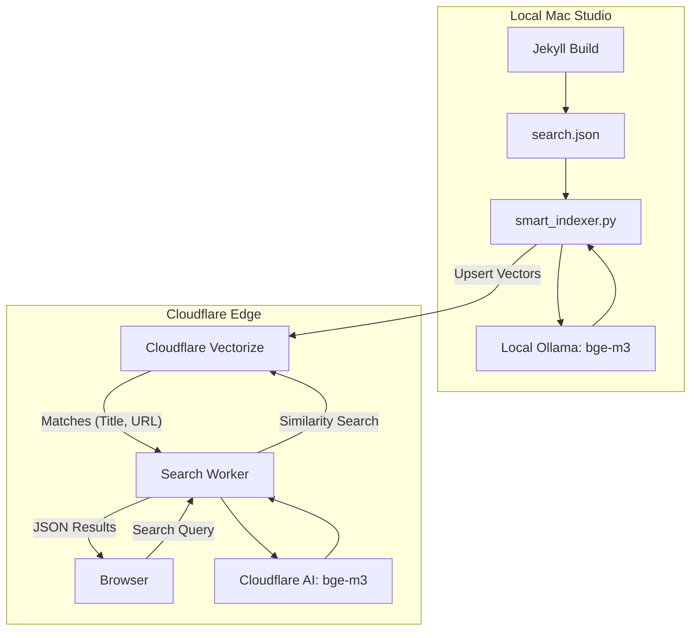

# Semantic Search API

This directory contains the Cloudflare Worker that handles live semantic search requests for the blog.

## System Architecture

The system uses a **Hybrid AI Architecture**:
1.  **Indexing (Local):** Your Mac Studio runs [Ollama](https://ollama.com/) locally to generate embeddings for all blog posts. This saves Cloudflare costs and keeps your source content private.
2.  **Storage & Search (Cloud):** Embeddings are uploaded to [Cloudflare Vectorize](https://developers.cloudflare.com/vectorize/). A Cloudflare Worker handles the user's search query by generating a small embedding for the query and finding similar posts.

## How the Indexer Works (`scripts/smart_indexer.py`)

-   **Hashing (ID):** Cloudflare Vectorize has a 64-byte ID limit. The indexer MD5-hashes the post URL slug to create a permanent, unique 32-character ID.
-   **Change Detection:** It hashes the post content locally (`scripts/.vector-cache.json`) to only upload posts that have changed.
-   **Automated Cleanup:** If a post is deleted from Jekyll, the indexer detects the orphan ID in its cache and deletes the vector from Cloudflare.
-   **Batching:** Processing is done in batches of 10 to ensure stability and save progress incrementally.

## Search API Worker (`src/index.js`)

The worker performs three main steps:
1.  **Embed Query:** Uses Cloudflare's `@cf/baai/bge-m3` to turn the user's text search into a vector.
2.  **Vector Search:** Queries the `blog-index` Vectorize index for the top 10 most similar vectors.
3.  **Metadata Extraction:** Returns the titles and URLs stored in the vector metadata.

## Setup & Maintenance

### Indexing New Posts
Whenever you add or delete content, run:
1.  `bundle exec jekyll build`
2.  `python3 scripts/smart_indexer.py`

### Environment Variables (.env)
Required for the indexer:
- `CF_ACCOUNT_ID`: Your Cloudflare account ID.
- `CF_API_TOKEN`: A token with Vectorize:Edit permissions.
